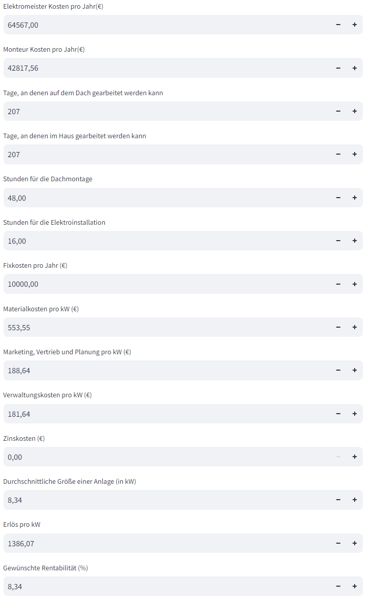
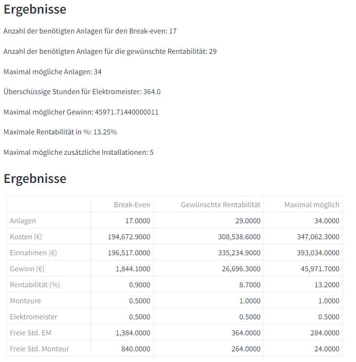
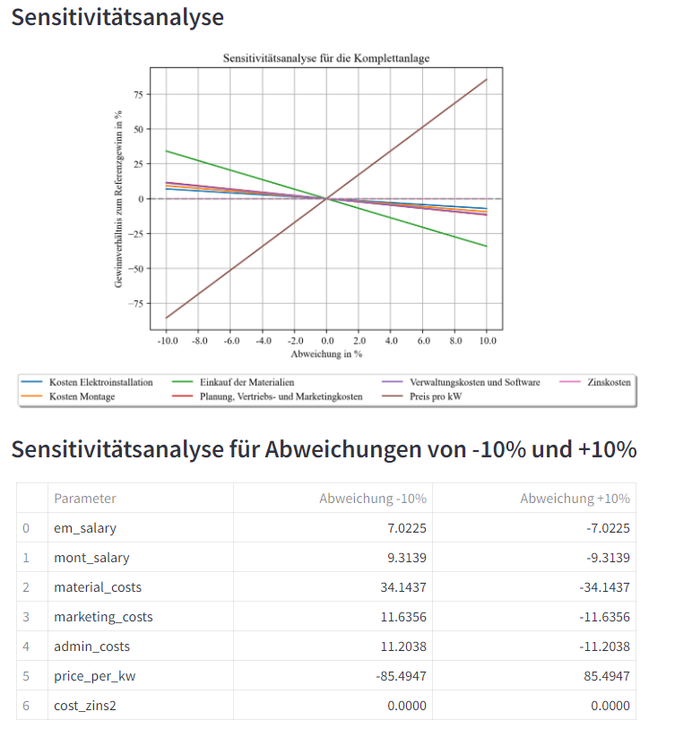

# Investitionsrechnung für Geschäftsmodelle in der PV-Branche

Dieses Projekt umfasst Tools zur Berechnung der Wirtschaftlichkeit einer Investition in ein Geschäftsmodell. Es berechnet Break-Even-Punkte, Rentabilität und die maximal mögliche Anzahl von Anlagen, die unter Berücksichtigung des vorhandenen Personals gebaut werden können.

## Projektbeschreibung

Das Toolset ermöglicht es Benutzern, die finanziellen Aspekte einer Investition in ein Geschäftsmodell zu analysieren. Es bietet Funktionen zur Berechnung des Break-Even-Punktes, der Rentabilität, führt eine Sensitivitätsanalyse durch und bestimmt die maximale Anzahl von Anlagen, die mit dem verfügbaren Personal installiert werden können.

## Technologien

- Python
- Streamlit
- Pandas
- Matplotlib
- Math

## Installation und Einrichtung

Klonen Sie das Repository und installieren Sie die erforderlichen Pakete:

```bash
git clone <https://github.com/oveknutzen/Rentabilitaetsrechnung-PV.git>
cd <Rentabilitaetsrechnung>
pip install -r requirements.txt
```
## Benutzung
Starten Sie die Streamlit-App, um die Benutzeroberfläche zu öffnen:

```bash
Copy code
streamlit run App_invest_sens.py
```
Öffnen Sie die angezeigte URL in Ihrem Browser, um die App zu verwenden und die Investitionsberechnungen durchzuführen.

## Dateistruktur
App_invest_sens.py: Hauptanwendung für die Streamlit-Oberfläche.
INVESTRECHNER.py: Modul zur Durchführung der Investitionsrechnung.
max_installation.py: Berechnet die maximale Anzahl an Installationen basierend auf dem Personal.
max_profit.py: Berechnet den maximalen Profit.
sensitivity_calculation.py: Führt die Sensitivitätsanalyse durch.
## Beitrag
Wenn Sie zum Projekt beitragen möchten, sind Pull Requests und Issues im Repository willkommen.
## Oberfläche




## Autoren
Kim Ove Knutzen
K.E.S. Knutzen Energy Solutions GmbH
## Lizenz
Dieses Projekt ist unter der MIT Lizenz im Rahmen einer Masterarbeit an der FH Münster erstellt worden.
